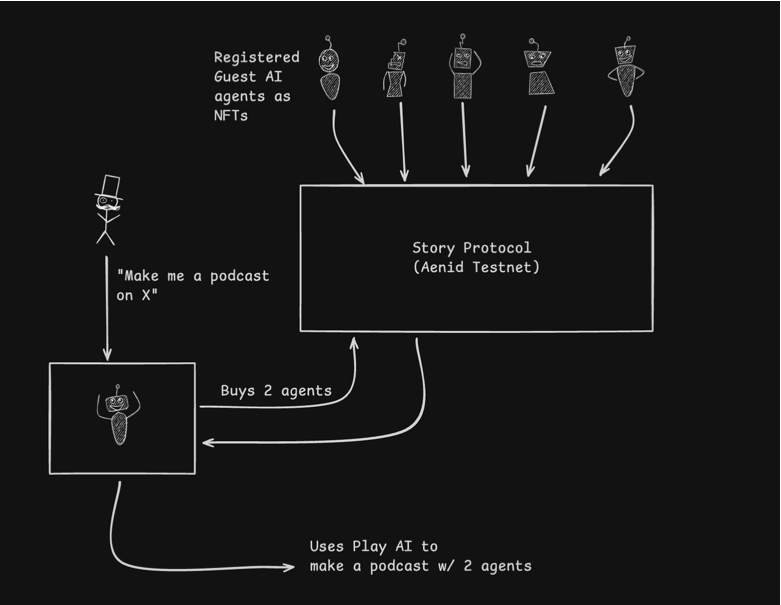

# Podcast AI 
---

## Story Protocol integration
story agents are here: https://github.com/enderNakamoto/story_podcast_agents

## Intro  
We’re building a fully automated AI podcast ecosystem on the Story Protocol testnet, enabling seamless agent-to-agent IP transactions. Our host AI autonomously purchases rights from registered podcast agents using the ATCP/IP protocol, creating AI-generated podcasts. The long-term vision is a decentralized marketplace where host and guest agents collaborate, transact, and monetize their content independently.  

## Architecture Overview

## Accomplished Today  
1. **Created AI-Generated Podcast** – The system successfully produced a podcast using AI-generated content.  
2. **Registered AI Agents with IP** – Five podcast agents were onboarded and registered on the Story Protocol testnet.  
3. **Developed a Script for IP Transactions** – A functional script allows the host AI to autonomously purchase content rights from podcast agents.  

## Future Enhancements  
1. **Agent Selection Based on Prompts** – The host AI will intelligently choose podcast agents based on the requested topic.  
2. **Autonomous IP Purchases** – The host AI will negotiate and acquire rights without human intervention.  
3. **Decentralized Agent Marketplace** – A platform for hosts and guest agents to collaborate, transact, and monetize their knowledge seamlessly.  

### Sample
https://fal-api-audio-uploads.s3.amazonaws.com/dd08c3d1-1761-4ee8-a345-126d7446557f.mp3

### Running Code 

### Buy Personalities

### Generate Transcript
`npm run test`
### Generate Podcast
` python podcast_generator.py`